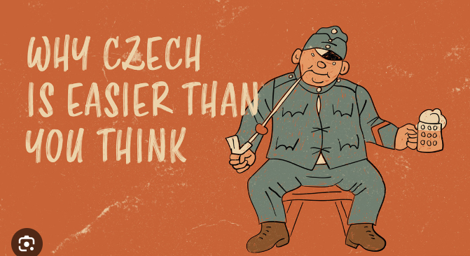

# Duolingo clone to learn Czech from Russian (built by [AutoCode](https://autocode.work) in 15 minutes)

## Project Overview

This project aims to create a language learning application similar to Duolingo,
specifically designed for Russian speakers to learn Czech. The app provides an
interactive and engaging platform for users to acquire Czech language skills
through various exercises and lessons.

## Features

-   User authentication and profile management
-   Mobile-first design
-   Russian UI
-   Structured lessons covering vocabulary, grammar, and pronunciation
-   Interactive exercises (multiple choice, fill-in-the-blanks, listening
    comprehension)
-   Progress tracking and performance analytics
-   Gamification elements (streaks, achievements, leaderboards)
-   Spaced repetition algorithm for efficient learning

## Technology Stack

-   Frontend: React with Material-UI for cross-platform mobile development
-   Backend: Node.js with Express.js
-   Database: MongoDB for flexible data storage
-   Authentication: JWT (JSON Web Tokens)
-   State Management: Context API

## Design Considerations

-   Implement a responsive design for various device sizes
-   Use a color scheme and typography that aligns with Czech and Russian
    cultural elements
-   Optimize app performance and minimize battery usage
-   Design a user-friendly onboarding process

## Project Structure

-   `src/`: Contains all frontend React components and logic
    -   `components/`: Reusable UI components
    -   `pages/`: Individual page components
    -   `contexts/`: React Context for state management
    -   `services/`: API service for backend communication
    -   `utils/`: Utility functions and theme configuration
-   `server/`: Backend Node.js and Express.js server
    -   `model/`: MongoDB schema definitions
-   `public/`: Static assets and HTML template
-   `docs/`: Documentation and marketing materials

## Future Enhancements

-   Voice recognition for pronunciation exercises
-   Integration with language exchange platforms
-   Customizable learning paths based on user goals
-   AI-powered chatbot for conversational practice
-   Offline mode for learning without internet connection
-   Social features for connecting with other learners
-   Integration with popular language proficiency tests

## Development Roadmap

1. Implement core functionality and basic lesson structure
2. Develop user authentication and profile management
3. Create interactive exercises and progress tracking
4. Implement gamification features and leaderboards
5. Optimize performance and user experience
6. Beta testing and user feedback collection
7. Continuous improvement and feature additions

# TODO

ERROR in ./src/pages/Achievements.js 20:27-48
export 'fetchUserAchievements' (imported as 'fetchUserAchievements') was not found in '../services/apiService' (possible exports: default)
ERROR in ./src/pages/Leaderboard.js 20:27-43
export 'fetchLeaderboard' (imported as 'fetchLeaderboard') was not found in '../services/apiService' (possible exports: default)
ERROR in ./src/pages/Lessons.js 18:37-49
export 'fetchLessons' (imported as 'fetchLessons') was not found in '../services/apiService' (possible exports: default)
ERROR in ./src/pages/Progress.js 22:27-44
export 'fetchUserProgress' (imported as 'fetchUserProgress') was not found in '../services/apiService' (possible exports: default)